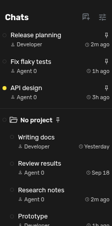

# Thread+

Thread+ adds a compact second line beneath chat titles in Agent Zero's sidebar. It works with the flat chat list, Sidebar Folders, and nested chats. The plugin uses existing chat snapshot fields and does not fetch chat histories or call an external service.

## Install and configure

Enable **Thread+**, reload the WebUI, then open its **Settings** page. Choose which fields to show and save.

**Save** persists these preferences globally in the plugin's `config.json`, including across page reloads. **Cancel** discards unsaved changes.

Available fields: last activity, new activity, working/paused state, project, agent profile, and creation date. Last activity can be relative or a calendar date. Last activity, new activity, and active state appear by default. A small dot in the main CSS highlight colour marks activity since you last viewed a chat; a progress icon means working and a pause icon means paused. Status icons are slightly larger than ordinary metadata, with no backgrounds, borders, or animation. Hover anywhere on the detail line for one tooltip with indicator meanings, names, and timestamps; indicators must not own nested tooltips. Names and dates stay readable, and the detail line has an accessible label with the full information. The activity baseline is stored in this browser's `localStorage`, so it is not synchronized across devices or browsers.

Context and status appear on the left of the detail line; last activity stays on the right. The tooltip shows the full activity timestamp without repeating the relative label, plus creation time and selected details. If the sidebar is narrow, the left detail text truncates rather than pushing the time or action buttons off screen. Disabling or removing the plugin restores the original one-line rows after a page reload. There are no dependencies, setup hooks, external accounts, or uninstall side effects.

Activity and Working state come from Agent Zero's context snapshots. If core supplies a stale timestamp or reports an executing subagent as idle, Thread+ displays those values; this plugin does not infer execution state or repair saved chat timestamps.

## Why these fields

Research found repeated demand for recency, project context, and visible active or unread state. An [Open WebUI issue](https://github.com/open-webui/open-webui/issues/26451) specifically distinguishes last activity from creation time. [Slack's unread view](https://slack.com/help/articles/226410907-View-all-your-unread-messages) uses concise previews and unread cues; [Slack's design account](https://slack.design/articles/threads-in-slack-a-long-design-journey-part-2-of-2/) describes testing thread navigation. Thread+ includes only fields already available in Agent Zero's sidebar snapshot, keeping the list fast and the plugin self-contained. Conversation summaries, model usage, and token costs need additional data sources, so this version does not claim to show them.

## Check

Run `node tests/test_frontend.mjs` from this repository root. Checks cover time formatting, new activity, icon rendering, loading saved visibility preferences, context updates, and tooltip timestamps. The source is a standalone Agent Zero plugin: `plugin.yaml`, `README.md`, and `LICENSE` live at the repository root.
